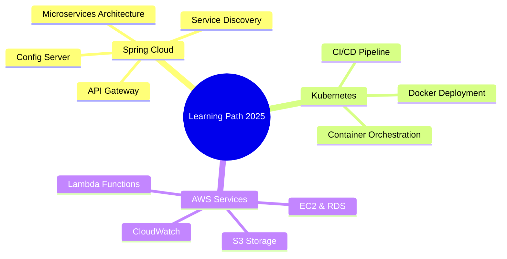

<div align="center">

<!-- 3D Animated Header -->


<!-- 3D Badges with Shadow Effects -->
[](https://ntt-dev-fpt.vercel.app)
[](mailto:thanhta110903@gmail.com)
[](https://www.linkedin.com/in/tài-nguyễn-813053294/)
[](https://www.facebook.com/profile.php?id=100029727378561)


</div>

---

## 💫 About Me

**Backend Developer** specializing in **Java Spring Boot** | Passionate about building scalable and high-performance systems

Hello! I'm **Nguyễn Thành Tài**, a Backend Developer from **Ho Chi Minh City, Vietnam**. I specialize in backend development with **Java Spring Boot**, while also having experience working with **Frontend** and **Mobile** development.

- 🎓 Currently studying **Software Engineering** at **FPT University**
- 🌱 Learning **Spring Cloud**, **Kubernetes**, and **AWS Services**
- 💼 Working on **E-commerce** and **Enterprise Applications**
- 📍 Based in **Ho Chi Minh City, Vietnam**
- 🎯 Hobbies: Coding, Reading Tech Blogs, Gaming

---

## 🛠️ Core Skills

```java
// Backend Development
Java 17 • Spring Boot 3.x • RESTful APIs • Microservices
JWT/OAuth2 • Spring Security • Swagger/OpenAPI
```

```typescript
// Frontend Development
React 18 • TypeScript • Next.js 14 • HTML5/CSS3
Tailwind CSS • Bootstrap 5 • Responsive Design
```

```kotlin
// Mobile Development
Android • Kotlin • Jetpack Compose • MVVM
Room Database • Retrofit • Material Design
```

```sql
-- Database & Tools
MySQL • PostgreSQL • MongoDB • Redis
Docker • Git • Postman • Jenkins
```

---

<div align="center">

## 🚀 Featured Projects

### 👉 Swipe to explore more projects

<table>
<tr>
<td width="25%" align="center">

### 🛍️ OnlyFanShop
**E-Commerce Platform**

🎯 **Main Features**
- Multi-role system
- Product management
- Shopping cart & checkout
- Payment integration
- Order tracking

⚡ **Tech Stack**
`Java 17` `Spring Boot 3.x`
`React 18` `MySQL`
`Redis` `VNPay`

[](https://github.com/NTT-DevFPT/OnlyFan)

</td>
<td width="25%" align="center">

### 🐟 Koi Express
**Logistics Platform**

🎯 **Main Features**
- Order management
- Route optimization
- Real-time tracking
- Delivery scheduling
- Customer portal

⚡ **Tech Stack**
`Java 11` `Spring Boot 2.7`
`React` `PostgreSQL`
`Google Maps API`

[](#)

</td>
<td width="25%" align="center">

### 📚 VNR202
**Book Rental System**

🎯 **Main Features**
- Book catalog
- Rental management
- User authentication
- Fine calculation
- Report generation

⚡ **Tech Stack**
`Java 11` `Spring Boot 2.7`
`Bootstrap 5` `MySQL`
`Spring Security`

[](https://github.com/NTT-DevFPT/VNR202)

</td>
<td width="25%" align="center">

### 📊 GitHub Lang Stats
**Custom API Service**

🎯 **Main Features**
- Language statistics
- GraphQL integration
- SVG card generation
- Vercel serverless
- 30-min caching

⚡ **Tech Stack**
`Node.js 18` `Vercel`
`GitHub GraphQL v4`
`SVG Generation`

[](https://github.com/NTT-DevFPT/github-lang-stats-api)

</td>
</tr>
</table>

</div>

---

## 🏆 Technology Proficiency

| Language/Framework | Experience Level | Project Types |
|:---|:---:|:---|
| ☕ Java | Advanced | Backend APIs, Microservices, E-commerce |
| 🍃 Spring Boot | Advanced | Enterprise Apps, REST APIs, Security |
| 🟢 JavaScript | Intermediate | Frontend Development, Web Apps |
| ⚛️ React | Intermediate | SPAs, Interactive UIs |
| 🔷 TypeScript | Intermediate | Type-safe Frontend Development |
| 🐬 MySQL | Intermediate | Database Design & Optimization |
| 🍃 MongoDB | Intermediate | NoSQL Solutions |
| 🤖 Android | Intermediate | Mobile Applications (Java/Kotlin) |

---

<div align="center">

## 📊 GitHub Stats

<table>
<tr>
<td width="50%" align="center">

### 🎨 Language Distribution


</td>
<td width="50%" align="center">

### 📈 Contribution Stats


</td>
</tr>
<tr>
<td colspan="2" align="center">

### 🔥 Contribution Activity


</td>
</tr>
</table>

</div>

---

## 🎯 Current Focus



---

<div align="center">

## 🌐 Connect With Me

[](https://ntt-dev-fpt.vercel.app)
[](https://www.linkedin.com/in/tài-nguyễn-813053294/)
[](https://www.facebook.com/profile.php?id=100029727378561)
[](mailto:thanhta110903@gmail.com)

---

### 💬 "Code is like humor. When you have to explain it, it's bad." - Cory House

**Thanks for visiting my profile! Feel free to explore my repositories and connect with me!** 🚀


</div>
