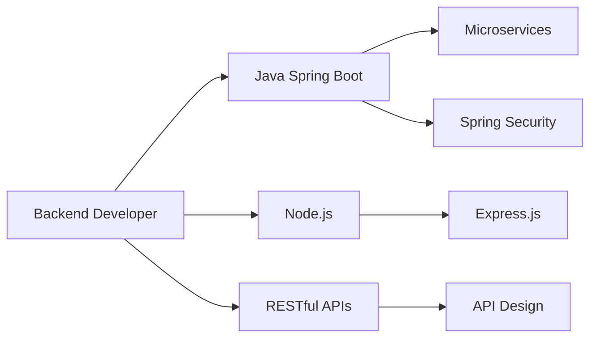

<div align="center">

# 👨‍💻 NGUYỄN THÀNH TÀI | Backend Developer

[](https://ntt-dev-fpt.vercel.app)
[](mailto:thanhtai10903@gmail.com)
[](https://www.linkedin.com/in/t%C3%A0i-nguy%E1%BB%85n-813053294/)
[](https://www.facebook.com/profile.php?id=100029723738561)

*Backend Developer chuyên về Java Spring Boot | Đam mê xây dựng hệ thống scalable và hiệu suất cao*

</div>

---

## 🌟 Về Tôi

Xin chào! Tôi là **Nguyễn Thành Tài**, một Backend Developer đến từ **Thành phố Hồ Chí Minh**. Tôi chuyên phát triển các ứng dụng backend với **Java Spring Boot**, đồng thời có kinh nghiệm làm việc với cả **Frontend** và **Mobile Development**.

- 🔭 **Hiện tại**: Đang xây dựng portfolio website cá nhân và các dự án e-commerce
- 🌱 **Đang học**: Chuyên sâu về **Spring Boot**, **GraphQL**, và **AWS Cloud**
- 💼 **Vị trí**: Backend Developer
- 📍 **Địa điểm**: HCM City, Vietnam
- ⚡ **Sở thích**: Chơi cờ vua, nghiên cứu các ngôn ngữ lập trình mới

---

## 💻 Kỹ Năng Chính

### Backend Development (Chuyên môn chính)

```java
// Core Backend Technologies
- Java ☕ (Spring Boot, Spring MVC, Spring Security)
- Node.js 🟢 (Express.js, REST APIs)
- RESTful API Design & Microservices
- Authentication & Authorization (JWT, OAuth2)
```

### Frontend Development

```javascript
// Frontend Technologies  
- React ⚛️ (Hooks, Context API, Redux)
- TypeScript 📘
- Next.js
- HTML5, CSS3, JavaScript (ES6+)
- Tailwind CSS, Bootstrap, SCSS
```

### Mobile Development

```kotlin
// Mobile Technologies
- Android (Java, Kotlin)
- React Native
```

### Database & Tools

```sql
-- Databases
MySQL, MongoDB, Firebase

-- DevOps & Tools
Git, GitHub, Docker, Nginx
AWS, Vercel, Netlify, Heroku
Postman, Figma
```

---

## 🛠️ Tech Stack

<div align="center">

### Backend


### Frontend


### Mobile


### Database


### DevOps & Tools


</div>

---

## 🚀 Dự Án Nổi Bật

### 🌀 [OnlyFanShop - E-Commerce Platform](https://github.com/NTT-DevFPT/OnlyFanshop_Mobile)
**E-commerce parody chuyên bán quạt điện** | `Java` `Spring Boot` `TypeScript` `React`

- 📱 **Mobile App**: Android app được xây dựng bằng Java với real-time chat, payment integration
- 🌐 **Web Platform**: TypeScript, Next.js frontend với responsive design
- 🔧 **Features**: 
  - Hệ thống quản lý sản phẩm đa dạng (quạt mini, quạt không cánh cao cấp)
  - Real-time chat support
  - Payment gateway integration
  - Admin dashboard
- 📦 **Tech Stack**: Java (Mobile), TypeScript/Next.js (Web), MySQL, Firebase

**Links**: 
- [📱 Mobile Repository](https://github.com/NTT-DevFPT/OnlyFanshop_Mobile)
- [🌐 Web Repository](https://github.com/NTT-DevFPT/OnlyFanShop_WEB)

---

### 🎯 [VNR_202 - Portfolio Website](https://vnr-202-sand.vercel.app)
**Modern Portfolio Website** | `JavaScript` `React` `Vercel`

- 🎨 Interactive và responsive design
- 🚀 Deployed trên Vercel với production-ready
- ⚡ Performance optimized
- 📊 Showcase projects, experience, và skills

**Link**: [🔗 Live Demo](https://vnr-202-sand.vercel.app) | [💻 Repository](https://github.com/NTT-DevFPT/VNR_202)

---

### 🤖 [Next.js AI Chatbot](https://github.com/NTT-DevFPT/nextjs-ai-chatbot)
**AI-Powered Chatbot Application** | `TypeScript` `Next.js` `AI Integration`

- 🧠 Tích hợp AI để xử lý chat thông minh
- 💬 Real-time conversation interface
- 🎨 Modern UI/UX với TypeScript
- 🔒 Private project với advanced features

---

### 🚂 [Koi Express](https://github.com/NTT-DevFPT/Koi-Express)
**Logistics Management System** | `JavaScript`

- 📦 Hệ thống quản lý vận chuyển
- 🗺️ Tracking và delivery management
- 📊 Dashboard cho admin và users

---

## 📊 GitHub Stats

<div align="center">


</div>

---

## 🎯 Chuyên Môn



### 🔥 Điểm Mạnh

✅ **Backend Architecture**: Thiết kế và xây dựng RESTful APIs scalable  
✅ **Java Spring Boot**: Framework chính cho enterprise applications  
✅ **Database Design**: Thiết kế schema tối ưu cho MySQL, MongoDB  
✅ **Full-Stack Mindset**: Hiểu biết cả Frontend và Mobile để tích hợp tốt hơn  
✅ **Problem Solving**: Giải quyết các vấn đề phức tạp với code clean và maintainable  

---

## 📫 Liên Hệ

<div align="center">

### 💬 Kết nối với tôi!

Tôi luôn sẵn sàng cho các cơ hội hợp tác, freelance projects, hoặc đơn giản là trao đổi về công nghệ!

[](mailto:thanhtai10903@gmail.com)
[](https://ntt-dev-fpt.vercel.app)
[](https://www.linkedin.com/in/t%C3%A0i-nguy%E1%BB%85n-813053294/)
[](https://www.facebook.com/profile.php?id=100029723738561)

---

### 🌟 "Code is like humor. When you have to explain it, it's bad." – Cory House

---


</div>
