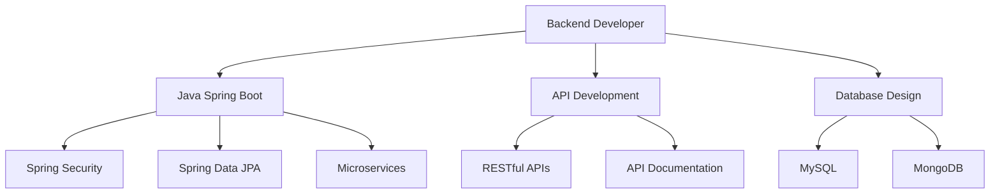

<div align="center">

# 👨‍💻 NGUYỄN THÀNH TÀI | Backend Developer

[](https://ntt-dev-fpt.vercel.app)
[](mailto:thanhtai10903@gmail.com)
[](https://www.linkedin.com/in/t%C3%A0i-nguy%E1%BB%85n-813053294/)
[](https://www.facebook.com/profile.php?id=100029723738561)

*Backend Developer specializing in Java Spring Boot | Passionate about building scalable and high-performance systems*

</div>

---

## 🌟 About Me

Hello! I'm **Nguyễn Thành Tài**, a Backend Developer from **Ho Chi Minh City, Vietnam**. I specialize in backend development with **Java Spring Boot**, while also having experience working with **Frontend** and **Mobile Development**.

- 🔭 **Currently**: Building personal portfolio website and e-commerce projects
- 🌱 **Learning**: Deep diving into **Spring Boot**, **GraphQL**, and **AWS Cloud**
- 💼 **Position**: Backend Developer
- 📍 **Location**: HCM City, Vietnam
- ⚡ **Hobbies**: Playing chess, exploring new programming languages

---

## 💻 Core Skills

### Backend Development (Primary Expertise)

```java
// Core Backend Technologies
- Java ☕ (Spring Boot, Spring MVC, Spring Security, Spring Data JPA)
- RESTful API Design & Development
- Microservices Architecture
- Authentication & Authorization (JWT, OAuth2)
- API Documentation (Swagger/OpenAPI)
```

### Frontend Development

```javascript
// Frontend Technologies  
- React ⚛️ (Hooks, Context API, Redux)
- TypeScript 📘
- Next.js
- HTML5, CSS3, JavaScript (ES6+)
- Tailwind CSS, Bootstrap, SCSS
```

### Mobile Development

```kotlin
// Mobile Technologies
- Android (Java, Kotlin)
- Android Studio & View Binding
```

### Database & Tools

```sql
-- Databases
MySQL, MongoDB, Firebase

-- DevOps & Tools
Git, GitHub, Docker, Nginx
AWS, Vercel, Heroku
Postman, Figma, ngrok
```

---

## 🛠️ Tech Stack

<div align="center">

### Backend


### Frontend


### Mobile


### Database


### DevOps & Tools


</div>

---

## 🚀 Featured Projects

### 🌀 [OnlyFanShop - E-Commerce Platform](https://github.com/NTT-DevFPT/OnlyFanshop_Mobile)
**E-commerce parody specializing in electric fans** | `Java` `Spring Boot` `TypeScript` `React`

- 📱 **Mobile App**: Android app built with Java featuring real-time chat and payment integration
- 🌐 **Web Platform**: TypeScript, Next.js frontend with responsive design
- 🔧 **Features**: 
  - Diverse product management system (mini fans, bladeless premium fans)
  - Real-time chat support
  - Payment gateway integration
  - Admin dashboard
- 📦 **Tech Stack**: Java (Mobile), TypeScript/Next.js (Web), MySQL, Firebase

**Links**: 
- [📱 Mobile Repository](https://github.com/NTT-DevFPT/OnlyFanshop_Mobile)
- [🌐 Web Repository](https://github.com/NTT-DevFPT/OnlyFanShop_WEB)

---

### 🎯 [VNR_202 - Portfolio Website](https://vnr-202-sand.vercel.app)
**Modern Portfolio Website** | `JavaScript` `React` `Vercel`

- 🎨 Interactive and responsive design
- 🚀 Deployed on Vercel with production-ready setup
- ⚡ Performance optimized
- 📊 Showcase projects, experience, and skills

**Link**: [🔗 Live Demo](https://vnr-202-sand.vercel.app) | [💻 Repository](https://github.com/NTT-DevFPT/VNR_202)

---

### 🚂 [Koi Express - Logistics Management System](https://github.com/NTT-DevFPT/Koi-Express)
**Professional Koi Fish Transportation System** | `Java` `JavaScript` `Spring Boot`

- 🐟 **Specialized Service**: Professional Koi fish transportation system providing safe delivery services across Vietnam with the highest safety standards
- 📦 **Core Features**:
  - Complete logistics management system from order placement to delivery
  - Real-time order tracking and status updates
  - Cost calculation by distance, Koi size, and special care requirements
  - Health monitoring and care during transit
  - Professional packaging and handling protocols
- 👥 **User Roles**:
  - **Customer Portal**: Place orders, track shipments, view delivery history
  - **Admin Dashboard**: Manage orders, drivers, routes, and system analytics
  - **Driver App**: Route management, delivery updates, Koi care documentation
- 🔧 **Technical Highlights**:
  - Backend: Java Spring Boot with RESTful APIs
  - Frontend: JavaScript for interactive UI
  - Database: MySQL for data management
  - Real-time notifications and updates
- 🎯 **Business Impact**: Ensuring safe and professional Koi fish transportation with complete tracking and care monitoring throughout the delivery process

**Link**: [💻 Repository](https://github.com/NTT-DevFPT/Koi-Express)

---

## 📊 GitHub Stats

<div align="center">


</div>

---

## 🎯 Professional Expertise



### 🔥 Core Strengths

✅ **Backend Architecture**: Design and build scalable RESTful APIs with best practices  
✅ **Java Spring Boot**: Primary framework for enterprise applications and microservices  
✅ **Database Design**: Optimize schema design for MySQL and MongoDB  
✅ **Full-Stack Mindset**: Understanding of Frontend and Mobile for better integration  
✅ **Problem Solving**: Tackle complex challenges with clean and maintainable code  
✅ **API Development**: Comprehensive experience in building and documenting APIs  

---

## 📫 Contact

<div align="center">

### 💬 Let's Connect!

I'm always open to collaboration opportunities, freelance projects, or simply discussing technology!

[](mailto:thanhtai10903@gmail.com)
[](https://ntt-dev-fpt.vercel.app)
[](https://www.linkedin.com/in/t%C3%A0i-nguy%E1%BB%85n-813053294/)
[](https://www.facebook.com/profile.php?id=100029723738561)

---

### 🌟 "Code is like humor. When you have to explain it, it's bad." – Cory House

---


</div>
